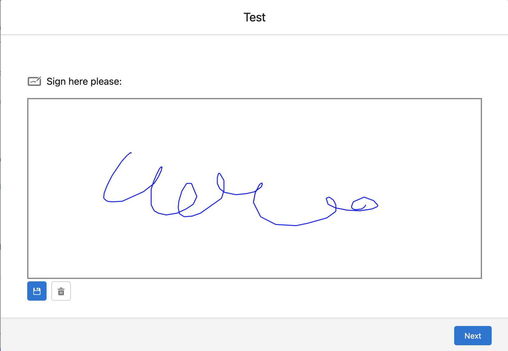
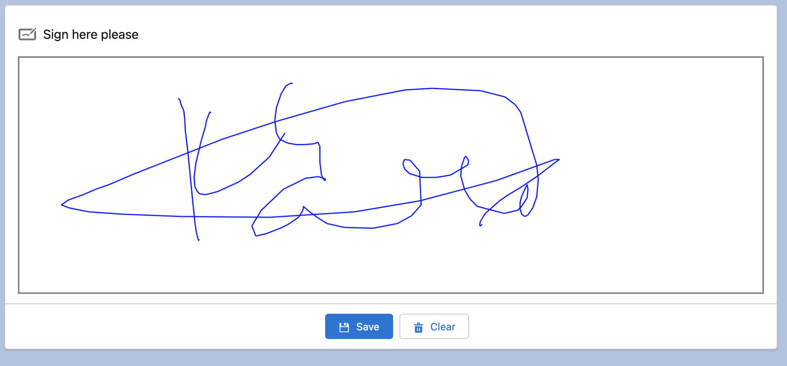
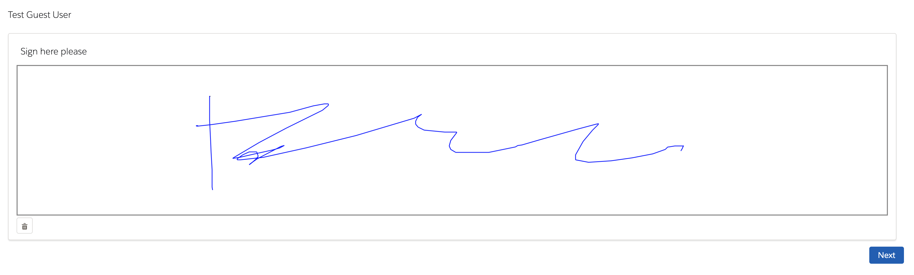
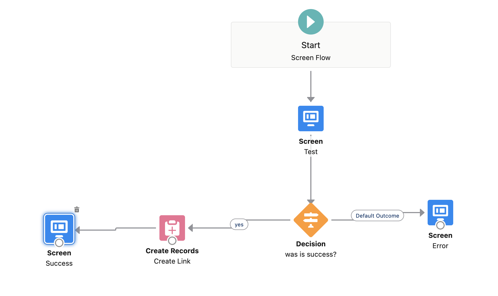
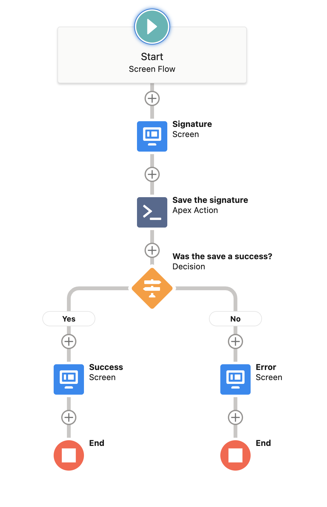

# Signature Pad

Lightning Web Component for a Signature Pad. Can be used in Lightning Experience and Flows. Supports Guest Users in Experience Cloud.
It creates a Salesforce File and a link with a record if specified.
Mobile responsive.

## Where can I use it?

You can use this component in Record Pages, App Pages, Home Pages, Flow screens and Experience Cloud Sites.

It allows Guest Users in Experience Cloud Sites to save a signature as a Salesforce File (this will depends on Salesforce security too). If it's a guest user you will need to do the link between the file and the record manually in some other way, because Salesforce does not allow Guest Users to insert ContentDocumentLink. A workaround for this is having a flow and manage the creation of the file and link in the flow, then expose the flow in the Experience Cloud Site.

## Properties

**Targets are:**

- lightning\_\_RecordPage
- lightning\_\_AppPage
- lightning\_\_HomePage
- lightning\_\_FlowScreen
- lightningCommunity\_\_Page

|                 Label                  | Property Name (in XML)  |                                                                                                                              Description                                                                                                                              |  Type   |      Required      |       Default Value       |                                       Options                                        |                                           Supported in                                           |
| :------------------------------------: | :---------------------: | :-------------------------------------------------------------------------------------------------------------------------------------------------------------------------------------------------------------------------------------------------------------------: | :-----: | :----------------: | :-----------------------: | :----------------------------------------------------------------------------------: | :----------------------------------------------------------------------------------------------: |
|              Show Title?               |        showTitle        |                                                                                                                     Show the Title above the box?                                                                                                                     | Boolean | :heavy_check_mark: |           true            |                                                                                      |                                               All                                                |
|                 Title                  |          title          |                       Title for the signature box.  <b>Note:</b> It can merge current record fields with e.g. {{Record.Name}}, but it's only supported in lightning\_\_RecordPage and lightningCommunity\_\_Page (if inside record context)                        | String  |        :x:         |     Sign here please      |                                                                                      |                                               All                                                |
|            Show Title Icon?            |        showIcon         |                                                                                                                      Show the Icon in the title                                                                                                                       | Boolean | :heavy_check_mark: |           false           |                                                                                      |                                               All                                                |
|               Icon Name                |        iconName         |                                                                                      Name of the icon to show in the title. Icons: https://www.lightningdesignsystem.com/icons/                                                                                       | String  |        :x:         |     utility:signature     |                                                                                      |                                               All                                                |
|          Box Width (px or %)           |        boxWidth         |                                                                    Width of the box for signing. It supports px and %. If you don't add the type it will default to px. Use % for responsiveness.                                                                     | String  | :heavy_check_mark: |           100%            |                                                                                      |                                               All                                                |
|          Box Height (px or %)          |        boxHeight        |                                                                                 Height of the box for signing. It supports px and %. If you don't add the type it will default to px.                                                                                 | String  | :heavy_check_mark: |           300px           |                                                                                      |                                               All                                                |
|         Box Border Width (px)          |     boxBorderWidth      |                                                                                                                  The width of the border of the box                                                                                                                   | String  | :heavy_check_mark: |            2px            |                                                                                      |                                               All                                                |
|            Box Border Style            |     boxBorderStyle      |                                                                                                                  The style of the border of the box                                                                                                                   | String  | :heavy_check_mark: |           solid           |          none, dotted, dashed, solid, double, groove, ridge, inset, outset           |                                               All                                                |
|            Box Border Color            |     boxBorderColor      |                                 The color of the border of the box. It suppors color name (blue), HEX (#0000FF), RGB (rgb(0, 0, 255)), RGBA (rgb(0, 0, 255, 1), HSL (hsl(240, 100%, 50%)) and HSLA (hsla(240, 100%, 50%, 1)) values.                                  | String  | :heavy_check_mark: |    rgb(136, 135, 135)     |                                                                                      |                                               All                                                |
|          Box Background Color          |      boxBackground      |                                                                                     The background color of the box. It suppors color name, HEX, RGB, RGBA, HSL and HSLA values.                                                                                      | String  | :heavy_check_mark: |        transparent        |                                                                                      |                                               All                                                |
|         Signature Line Stroke          |       lineStroke        |                                                                               The Stroke style for the signature. It supports any color (see boxBorderColor help), gradient or pattern.                                                                               | String  | :heavy_check_mark: |           blue            |                                                                                      |                                               All                                                |
|          Signature Line Width          |        lineWidth        |                                                                                                             The width (px) of the line for the signature.                                                                                                             | String  | :heavy_check_mark: |            1.5            |                                                                                      |                                               All                                                |
|           Save Button Label            |        saveLabel        |                                                                                                                       Label for the Save button                                                                                                                       | String  | :heavy_check_mark: |           Save            |                                                                                      |                                               All                                                |
|            Save Button Icon            |        saveIcon         |                                                                                                                       Icon for the Save button                                                                                                                        | String  | :heavy_check_mark: |       utility:save        |                                                                                      |                                               All                                                |
|          Save Button Variant           |       saveVariant       |                                                                                                                      Variant for the Save button                                                                                                                      | String  | :heavy_check_mark: |           brand           | base, neutral, brand, brand-outline, destructive, destructive-text, inverse, success |                                               All                                                |
|           Clear Button Label           |       clearLabel        |                                                                                                                      Label for the Clear button                                                                                                                       | String  | :heavy_check_mark: |           Clear           |                                                                                      |                                               All                                                |
|           Clear Button Icon            |        clearIcon        |                                                                                                                       Icon for the Clear button                                                                                                                       | String  | :heavy_check_mark: |      utility:delete       |                                                                                      |                                               All                                                |
|          Clear Button Variant          |      clearVariant       |                                                                                                                     Variant for the Clear button                                                                                                                      | String  | :heavy_check_mark: |          neutral          | base, neutral, brand, brand-outline, destructive, destructive-text, inverse, success |                                               All                                                |
|            Button Alignment            |     buttonsPosition     |                                                                                                                        Position of the buttons                                                                                                                        | String  | :heavy_check_mark: |          center           |                                 left, center, right                                  |                                               All                                                |
|           Title for the File           |        fileTitle        |                                                                                            Title of the file to save. If not specified a generic title will be generated.                                                                                             | String  |        :x:         |                           |                                         All                                          |
|              File Format               |       saveFormat        |                                                                                                                 The format for the file to be saved.                                                                                                                  | String  | :heavy_check_mark: |         image/png         |                                 image/png, image/jpg                                 |                                               All                                                |
| Clear Signature After Successful Save? | clearSignatureAfterSave |                                                                                                            Clear the signature box after a successful save                                                                                                            | Boolean | :heavy_check_mark: |           true            |                                                                                      |                                               All                                                |
|     Save File and Link to Record?      |   saveAndLinkToRecord   |                                                                                                       Save the file and create a link to the record specified.                                                                                                        | Boolean | :heavy_check_mark: |           true            |                                                                                      |           lightning\_\_RecordPage, lightning\_\_FlowScreen, lightningCommunity\_\_Page           |
|        Field with Id to Link To        |    recordIdToLinkTo     | The API Field name of the record id field that we want to link the file to. If not specified it will use the current Record Id.  <b>Note:</b> It can merge current record fields with e.g. {{Record.AccountId}}, but it's not supported in lightning\_\_FlowScreen | String  |        :x:         |                           |                                                                                      |           lightning\_\_RecordPage, lightning\_\_FlowScreen, lightningCommunity\_\_Page           |
|  Display Toast After Successful Save?  |     showToastOnSave     |                                                                                                            Display a toast message after a successful Save                                                                                                            | Boolean | :heavy_check_mark: |           true            |                                                                                      | lightning\_\_RecordPage, lightning\_\_AppPage, lightning\_\_HomePage, lightningCommunity\_\_Page |
|        Successful Toast Message        |      toastMessage       |                                                                                                           Message for the toast message when is successful                                                                                                            | String  | :heavy_check_mark: |  File successfully saved  |                                                                                      | lightning\_\_RecordPage, lightning\_\_AppPage, lightning\_\_HomePage, lightningCommunity\_\_Page |
|               Required?                |       isRequired        |                                                                                                                Is the Signature Required?. INPUT ONLY.                                                                                                                | Boolean | :heavy_check_mark: |           true            |                                                                                      |                                     lightning\_\_FlowScreen                                      |
|           Show Save button?            |     showSaveButton      |                                                                                                               Show the Save button or not. INPUT ONLY.                                                                                                                | Boolean | :heavy_check_mark: |           false           |                                                                                      |                                     lightning\_\_FlowScreen                                      |
|      Show Label and Icon Buttons?      | showLabelAndIconButtons |                                                                                                   Show Label and Icon in the buttons or just the icon?. INPUT ONLY.                                                                                                   | Boolean | :heavy_check_mark: |           false           |                                                                                      |                                     lightning\_\_FlowScreen                                      |
|            Required Message            |     requiredMessage     |                                                                                                               Required message to display. INPUT ONLY.                                                                                                                | String  | :heavy_check_mark: | The signature is required |                                                                                      |                                     lightning\_\_FlowScreen                                      |
|              Is Success?               |       saveSuccess       |                                                                                                             Was the save action a success?. OUTPUT ONLY.                                                                                                              | Boolean |                    |                           |                                                                                      |                                     lightning\_\_FlowScreen                                      |
|             Error Message              |      errorMessage       |                                                                                                           Error message when saving (if any). OUTPUT ONLY.                                                                                                            | String  |                    |                           |                                                                                      |                                     lightning\_\_FlowScreen                                      |
|          Content Document Id           |    contentDocumentId    |                                                                                          The Id of the Content Document Record that was created (if required). OUTPUT ONLY.                                                                                           | String  |                    |                           |                                                                                      |                                     lightning\_\_FlowScreen                                      |
|           Content Version Id           |    contentVersionId     |                                                                                           The Id of the Content Version Record that was created (if required). OUTPUT ONLY.                                                                                           | String  |                    |                           |                                                                                      |                                     lightning\_\_FlowScreen                                      |
|        Content Document Link Id        |  contentDocumentLinkId  |                                                                                        The Id of the Content Document Link Record that was created (if required). OUTPUT ONLY.                                                                                        | String  |                    |                           |                                                                                      |                                     lightning\_\_FlowScreen                                      |
|   Signature in Base64 Encoded String   |       fileBase64        |                                                                                                The Base64 encoded string of the file with the signature. OUTPUT ONLY.                                                                                                 | String  |                    |                           |                                                                                      |                                     lightning\_\_FlowScreen                                      |
|             File Extension             |      fileExtension      |                                                                                                           Extension of the file (png or jpg).. OUTPUT ONLY.                                                                                                           | String  |                    |                           |                                                                                      |                                     lightning\_\_FlowScreen                                      |
|               Record Id                |        recordId         |                                               Automatically bind the page's record id to the component variable. This is because Experience Cloud does not populate the recordId automatically from the record Context.                                               | String  |    {!recordId}     |                           |                                                                                      |                                    lightningCommunity\_\_Page                                    |
|              Object Name               |      objectApiName      |                                            Automatically bind the page's object name to the component variable. This is because Experience Cloud does not populate the objectApiName automatically from the object Context                                            | String  |  {!objectApiName}  |                           |                                                                                      |                                    lightningCommunity\_\_Page                                    |

## Live Demo

Live Demo on a Scratch Org: <a href="https://hosted-scratch.herokuapp.com/launch?template=https://github.com/ondutysoftwaresolutions/signaturePad">CLICK HERE</a>

## Installation

## Screenshots

### Inside a flow

### Inside a Record Page

### Inside Experience Cloud - Guest User

## Examples

### Flow Example 1

You receive the content document id back from the component and manually insert the Content Document Link

### Flow Example 2

You receive the base64 string from the component and call the invocable method to save the signature and link. This is the approach for Guest Users in Experience Cloud.

